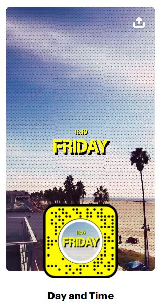
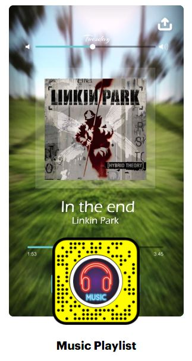

<!DOCTYPE html>
<html lang="en">

<head>
  <meta charset="utf-8">
  <meta content="width=device-width, initial-scale=1.0" name="viewport">

  <title>Jerome's Portfolio</title>
  <meta content="" name="description">
  <meta content="" name="keywords">

  <!-- Favicons -->
  <link href="assets/img/favicon.png" rel="icon">
  <link href="assets/img/apple-touch-icon.png" rel="apple-touch-icon">

  <!-- Google Fonts -->
  <link href="https://fonts.googleapis.com/css?family=Open+Sans:300,300i,400,400i,600,600i,700,700i|Raleway:300,300i,400,400i,500,500i,600,600i,700,700i|Poppins:300,300i,400,400i,500,500i,600,600i,700,700i" rel="stylesheet">

  <!-- Vendor CSS Files -->
  <link href="assets/vendor/aos/aos.css" rel="stylesheet">
  <link href="assets/vendor/bootstrap/css/bootstrap.min.css" rel="stylesheet">
  <link href="assets/vendor/bootstrap-icons/bootstrap-icons.css" rel="stylesheet">
  <link href="assets/vendor/boxicons/css/boxicons.min.css" rel="stylesheet">
  <link href="assets/vendor/glightbox/css/glightbox.min.css" rel="stylesheet">
  <link href="assets/vendor/swiper/swiper-bundle.min.css" rel="stylesheet">

  <!-- Template Main CSS File -->
  <link href="assets/css/style.css" rel="stylesheet">

</head>

<body>

  <!-- ======= Mobile nav toggle button ======= -->
  <i class="bi bi-list mobile-nav-toggle d-xl-none"></i>

  <!-- ======= Header ======= -->
  <header id="header">
    

      

        
        <h1 class="text-light"><a href="index.html">Jerome K</a></h1>
        

          <a href="https://www.facebook.com/ivan.jerome.99/" class="facebook"><i class="bx bxl-facebook"></i></a>
          <a href="https://www.instagram.com/ivan_jerome/" class="instagram"><i class="bx bxl-instagram"></i></a>
          <a href="https://www.linkedin.com/in/jerome99/" class="linkedin"><i class="bx bxl-linkedin"></i></a>
        

      

      <nav id="navbar" class="nav-menu navbar">
        <ul>
          <li><a href="#hero" class="nav-link scrollto active"><i class="bx bx-home"></i> Home</a></li>
          <li><a href="#about" class="nav-link scrollto"><i class="bx bx-user"></i> About</a></li>
          <li><a href="#resume" class="nav-link scrollto"><i class="bx bx-file-blank"></i> Resume</a></li>
          <li><a href="#portfolio" class="nav-link scrollto"><i class="bx bx-book-content"></i> Portfolio</a></li>
          <li><a href="#contact" class="nav-link scrollto"><i class="bx bx-envelope"></i> Contact</a></li>
        </ul>
      </nav><!-- .nav-menu -->
    

  </header><!-- End Header -->

  <!-- ======= Hero Section ======= -->
  <section id="hero" class="d-flex flex-column justify-content-center align-items-center">
    

      <h1>Jerome K</h1>
      
I'm a 

    

  </section><!-- End Hero -->

  <main id="main">

    <!-- ======= About Section ======= -->
    <section id="about" class="about">
      

        

          <h2>About</h2>
          

            Hi there, I'm Jerome, Strong in design and integration with intuitive problem-solving skills. Passionate about implementing and launching new projects. Ability to translate business requirements into technical solutions. 
          

        

        

          

            
          

          

             
             
            <h3>Performance Analyst &amp; Developer</h3>
            

              
            

            

              

                <ul>
                  <li><i class="bi bi-chevron-right"></i> <strong>Birthday:</strong> 11 Jan 1999</li>
                  <!-- <li><i class="bi bi-chevron-right"></i> <strong>Website:</strong> www.example.com</li> -->
                  <li><i class="bi bi-chevron-right"></i> <strong>Phone:</strong> +91 9840940416</li>
                  <li><i class="bi bi-chevron-right"></i> <strong>City:</strong> Chennai, India</li>
                </ul>
              

              

                <ul>
                  <li><i class="bi bi-chevron-right"></i> <strong>Age:</strong> 22</li>
                  <li><i class="bi bi-chevron-right"></i> <strong>Degree:</strong> B.E</li>
                  <li><i class="bi bi-chevron-right"></i> <strong>Email:</strong> ivanjerome99@gmail.com</li>
                  <!-- <li><i class="bi bi-chevron-right"></i> <strong>Freelance:</strong> Available</li> -->
                </ul>
              

            

            

              Performance-driven and results-oriented individual with a pro-active
approach and determination to meet all assigned goals and objectives.
            

          

        

      

    </section><!-- End About Section -->

    <!-- ======= Facts Section ======= -->
    <!-- <section id="facts" class="facts">
      

        

          <h2>Facts</h2>
          
Magnam dolores commodi suscipit. Necessitatibus eius consequatur ex aliquid fuga eum quidem. Sit sint consectetur velit. Quisquam quos quisquam cupiditate. Et nemo qui impedit suscipit alias ea. Quia fugiat sit in iste officiis commodi quidem hic quas.

        

        

          

            

              <i class="bi bi-emoji-smile"></i>
              
              
<strong>Happy Clients</strong> consequuntur quae

            

          

          

            

              <i class="bi bi-journal-richtext"></i>
              
              
<strong>Projects</strong> adipisci atque cum quia aut

            

          

          

            

              <i class="bi bi-headset"></i>
              
              
<strong>Hours Of Support</strong> aut commodi quaerat

            

          

          

            

              <i class="bi bi-people"></i>
              
              
<strong>Hard Workers</strong> rerum asperiores dolor

            

          

        

      

    </section>End Facts Section -->

    <!-- ======= Skills Section ======= -->
    <section id="skills" class="skills section-bg">
      

        

          <h2>Skills</h2>
          
Demonstrated excellence in the following skills and works on delivering a quality service and outcome

        

        

          

            

              HTML <i class="val">80%</i>
              

                

              

            

            

              CSS <i class="val">75%</i>
              

                

              

            

            

              JavaScript <i class="val">60%</i>
              

                

              

            

          

          

            

               Performance Tool (LoadRunner, JMeter) <i class="val">80%</i>
              

                

              

            

            

              WordPress <i class="val">90%</i>
              

                

              

            

            

              Business development<i class="val">60%</i>
              

                

              

            

          

        

      

    </section><!-- End Skills Section -->

    <!-- ======= Resume Section ======= -->
    <section id="resume" class="resume">
      

        

          <h2>Resume</h2>
         
        

        

          

            <h3 class="resume-title">Sumary</h3>
            

              <h4>Jerome K</h4>
              
<em>Performance-driven and results-oriented individual with a pro-active
                approach and determination to meet all assigned goals and
                objectives. Effective team player with excellent analytical skills and the
                important ability to solve complex problems.
                </em>

            

            <h3 class="resume-title">Education</h3>
            

              <h4>Bachelor of Engineering in CS</h4>
              <h5>2016 - 2020</h5>
              
<em>St.Joseph's college of engineering</em>

              
Graduated as first class distinction with a CGPA of 7.27

            

            

              <h4>Higher Secondary Education</h4>
              <h5>2015 - 2016</h5>
              
<em>Chettinad Vidyashram</em>

              
Secured 91.4% in CBSE board &amp; scored 99 in Computer Science

              

              

                <h4>Senior Secondary School </h4>
                <h5>2013 - 2014</h5>
                
<em>St.John's Senior Secondary School & Junior College</em>

                
 Secured 8.2 CGPA in CBSE Board

                

                <h3 class="resume-title">Achievements</h3>
                

                  <li>Finalists for Smart India Hackathon Software Edition 2019
                  </li>
                  <li> Winner of Arduino Challenge at Easwari Engineering college
                  </li>
                  <li>Runner-up at Kaizen Robotics Program at IIT Madras Research Park  </li>
              

    
          

          <!-- sdsjdsd -->
         
          

          

            <h3 class="resume-title">Professional Experience</h3>
            

              <h4>Performance Analyst</h4>
              <h5>Oct 2020- Present</h5>
              
<em>Cognizant Technology Solutions | Chennai </em>

              <ul>
                <li> Working for a UK based client “John Lewis Partnership” under Quality Engineering and Assurance.</li>
                  <li> Testing and processing the stability of online web applications by determining the speed,
                  responsiveness, and load.</li>
                  <li> Programming Language and Tools: Java, LoadRunner, JMeter</li>
              </ul>
            

            

              <h4>Intern Trainee</h4>
              <h5>Dec 2019 – Jul 2020</h5>
              
<em>Cognizant Technology Solutions | Chennai</em>

              <ul>
                <li> Learned and implemented Performance Testing, Accessibility Testing, and Non-Functional Testing.</li>
                  <li> Participated in a Hackathon to implement JSON parsing.</li>
                    <li> Programming Language and Tools: Java, C, LoadRunner, JMeter.</li>
              </ul>
            

            

              <h4>Network Intern</h4>
              <h5>Jun 2018 – Jul 2018</h5>
              
<em> Airport Authority of India (AAI) | Chennai</em>

              <ul>
                <li> Worked with servers by segregating and assigning individual IP addresses to Airline Operators.</li>
                <li> Concepts covered were Storage Unit, RAID and DNS servers, and Network Protocols.</li>
                <li> Tools: HP BladeSystem Onboard Administrator</li>
                  
              </ul>
            

          

        

      

    </section><!-- End Resume Section -->

    <section id="portfolio" class="portfolio section-bg">
      

        

          <h2>Portfolio</h2>

          <h4>Augumented Reality Effects</h4>
          

            Augumented Reality has been integrated in top social platforms as an interactive tool for the users to explore the AR technology with the real world in a fun manner using their own mobile phones. I'm able to create those interactive ,fun,entertaining and innovative AR effects for <b>Snapchat</b> using their Lens Studio software.
          
 

        

          

            <ul id="portfolio-flters">

            </ul>
          

        

        

          

            

              
              

                <a href="assets/img/portfolio/portfolio-1.jpg" data-gallery="portfolioGallery" class="portfolio-lightbox" title="App 1"><i class="bx bx-plus"></i></a>
                <a href="https://www.snapchat.com/unlock/?type=SNAPCODE&uuid=06007ac99e3a453ea87b952958403f9d&metadata=01" title="More Details"><i class="bx bx-link"></i></a>
              

            

          

          

            

              
              

                <a href="assets/img/portfolio/portfolio-2.jpg" data-gallery="portfolioGallery" class="portfolio-lightbox" title="Web 3"><i class="bx bx-plus"></i></a>
                <a href="https://www.snapchat.com/unlock/?type=SNAPCODE&uuid=e8996c8b0266456a8cdb05c4f6d79ef2&metadata=01" title="More Details"><i class="bx bx-link"></i></a>
              

            

          

          

            

              
              

                <a href="assets/img/portfolio/portfolio-3.jpg" data-gallery="portfolioGallery" class="portfolio-lightbox" title="App 2"><i class="bx bx-plus"></i></a>
                <a href="https://www.snapchat.com/unlock/?type=SNAPCODE&uuid=db4207ecbbaa480da507dd45b7f425a5&metadata=01" title="More Details"><i class="bx bx-link"></i></a>
              

            

          

          

            

              
              

                <a href="assets/img/portfolio/portfolio-4.jpg" data-gallery="portfolioGallery" class="portfolio-lightbox" title="Card 2"><i class="bx bx-plus"></i></a>
                <a href="https://www.snapchat.com/unlock/?type=SNAPCODE&uuid=f2744fd5685a45ceb9190ecb2eafdbb3&metadata=01" title="More Details"><i class="bx bx-link"></i></a>
              

            

          

          

            

              
              

                <a href="assets/img/portfolio/portfolio-5.jpg" data-gallery="portfolioGallery" class="portfolio-lightbox" title="Web 2"><i class="bx bx-plus"></i></a>
                <a href="https://www.snapchat.com/unlock/?type=SNAPCODE&uuid=4eeb6be5f71d486290465ca6b220e1cc&metadata=01" title="More Details"><i class="bx bx-link"></i></a>
              

            

          

          

            

              
              

                <a href="assets/img/portfolio/portfolio-6.jpg" data-gallery="portfolioGallery" class="portfolio-lightbox" title="App 3"><i class="bx bx-plus"></i></a>
                <a href="https://www.snapchat.com/unlock/?type=SNAPCODE&uuid=ca31eab6e6de43c38ac74d897672742b&metadata=01" title="More Details"><i class="bx bx-link"></i></a>
              

            

          

          

            

              
              

                <a href="assets/img/portfolio/portfolio-7.jpg" data-gallery="portfolioGallery" class="portfolio-lightbox" title="Card 1"><i class="bx bx-plus"></i></a>
                <a href="https://www.snapchat.com/unlock/?type=SNAPCODE&uuid=435fa598a0684850a674296ab98f5652&metadata=01" title="More Details"><i class="bx bx-link"></i></a>
              

            

          

          

            

              
              

                <a href="assets/img/portfolio/portfolio-8.jpg" data-gallery="portfolioGallery" class="portfolio-lightbox" title="Card 3"><i class="bx bx-plus"></i></a>
                <a href="https://www.snapchat.com/unlock/?type=SNAPCODE&uuid=5167f4c6451e4eb28415afdcdd5079a3&metadata=01" title="More Details"><i class="bx bx-link"></i></a>
              

            

          

          

            

              
              

                <a href="assets/img/portfolio/portfolio-9.jpg" data-gallery="portfolioGallery" class="portfolio-lightbox" title="Web 3"><i class="bx bx-plus"></i></a>
                <a href="https://www.snapchat.com/unlock/?type=SNAPCODE&uuid=5d7c7987df694baf8aed89ef188eddf4&metadata=01" title="More Details"><i class="bx bx-link"></i></a>
              

            

          

        

      

    </section>
    <!-- End Portfolio Section -->

    <!-- ======= Services Section ======= -->
   

    <!-- ======= Testimonials Section ======= -->
   

    <!-- ======= Contact Section ======= -->
    <section id="contact" class="contact">
      

        

          <h2>Contact</h2>
          

        

        

          

            

              

                <i class="bi bi-geo-alt"></i>
                <h4>Location:</h4>
                
R.A Puram, Chennai

              

              

                <i class="bi bi-envelope"></i>
                <h4>Email:</h4>
                
ivanjerome99@gmail.com

              

              

                <i class="bi bi-phone"></i>
                <h4>Call:</h4>
                
+91 9840940416

              

              <iframe src="https://www.google.com/maps/embed?pb=!1m14!1m12!1m3!1d248757.5231366794!2d80.2212715!3d13.046089900000002!2m3!1f0!2f0!3f0!3m2!1i1024!2i768!4f13.1!5e0!3m2!1sen!2sin!4v1618654906087!5m2!1sen!2sin" frameborder="0" style="border:0; width: 100%; height: 290px;" allowfullscreen></iframe>
            

          

          

            <form action="forms/contact.php" method="post" role="form" class="php-email-form">
              

                

                  <label for="name">Your Name</label>
                  <input type="text" name="name" class="form-control" id="name" required>
                

                

                  <label for="name">Your Email</label>
                  <input type="email" class="form-control" name="email" id="email" required>
                

              

              

                <label for="name">Subject</label>
                <input type="text" class="form-control" name="subject" id="subject" required>
              

              

                <label for="name">Message</label>
                <textarea class="form-control" name="message" rows="10" required></textarea>
              

              

                
Loading

                

                
Your message has been sent. Thank you!

              

              
<button type="submit">Send Message</button>

            </form>
          

        

      

    </section><!-- End Contact Section -->

  </main><!-- End #main -->

  <!-- ======= Footer ======= -->
  <footer id="footer">
    

      

        &copy;  <strong></strong>
      

      

        <!-- All the links in the footer should remain intact. -->
        <!-- You can delete the links only if you purchased the pro version. -->
        <!-- Licensing information: https://bootstrapmade.com/license/ -->
        <!-- Purchase the pro version with working PHP/AJAX contact form: https://bootstrapmade.com/iportfolio-bootstrap-portfolio-websites-template/ -->
      

    

  </footer><!-- End  Footer -->

  <a href="#" class="back-to-top d-flex align-items-center justify-content-center"><i class="bi bi-arrow-up-short"></i></a>

  <!-- Vendor JS Files -->
  
  
  
  
  
  
  
  
  

  <!-- Template Main JS File -->
  

</body>

</html>
